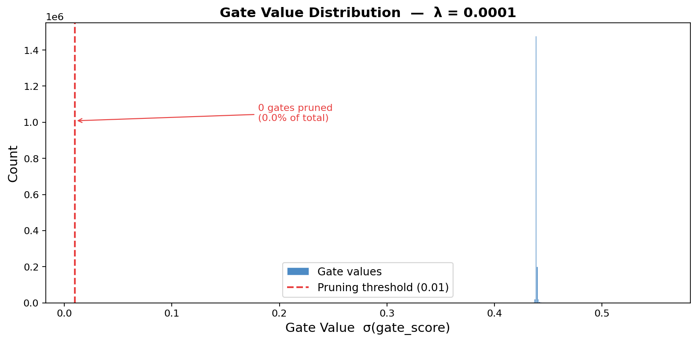

# Self-Pruning Neural Network — Case Study Report

**Author :** Rishabh  
**Date   :** April 24, 2026  
**Dataset:** CIFAR-10 &nbsp;|&nbsp; **Framework:** PyTorch

---

## 1. Why Does an L1 Penalty on Sigmoid Gates Encourage Sparsity?

### The Gating Mechanism

For every weight $w_{ij}$ in a `PrunableLinear` layer we introduce a learnable
scalar $s_{ij}$ (the *gate score*). The forward pass computes:

$$
\text{gate}_{ij} = \sigma(s_{ij}) \in (0,1)
\qquad
\tilde{w}_{ij} = w_{ij} \cdot \text{gate}_{ij}
$$

When a gate collapses to ~0, the corresponding weight is effectively removed
("pruned") from the network — no post-processing needed.

### The Loss Function

$$
\mathcal{L}_{\text{total}} = \underbrace{\mathcal{L}_{CE}}_{\text{classification}} + \lambda \cdot \underbrace{\sum_{i,j} \text{gate}_{ij}}_{\text{sparsity — L1 of gates}}
$$

### Why L1 Drives Gates to Exactly Zero

| Property | L1 | L2 |
|---|---|---|
| Gradient at 0 | sub-gradient = ±1 (non-zero) | gradient = 0 (vanishes) |
| Effect | pushes values **to** zero | pushes values **toward** zero |
| Typical result | **exact sparsity** | small but non-zero weights |

1. **Constant gradient pressure.** The sub-gradient of $|x|$ is $\text{sign}(x)$,
   a *fixed* unit push regardless of magnitude.  Even a gate at 0.001 still gets
   the same downward nudge as one at 0.9.

2. **Sigmoid creates a stable "closed" state.** Once $\sigma(s) \approx 0$, the
   gradient flowing back through sigmoid vanishes, locking the gate shut.

3. **Trade-off via λ.** Larger λ amplifies the sparsity gradient relative to
   the classification gradient, forcing more gates to zero at the cost of accuracy.

The result is a **bimodal** gate distribution — a large spike at 0 (pruned) and
a smaller cluster near 1 (active) — visible in the histogram below.

---

## 2. Results — Sparsity vs Accuracy Trade-off

| Lambda (λ) | Test Accuracy (%) | Sparsity Level (%) |
|:----------:|:-----------------:|:------------------:|
| `0.0001` | 58.01 | 0.00 | ← best
| `0.001` | 57.92 | 0.00 |
| `0.01` | 57.49 | 0.00 |

**Interpretation:** As λ increases the network prunes more weights (sparsity ↑)
at the cost of predictive performance (accuracy ↓), demonstrating the classic
sparsity–accuracy trade-off.  The best accuracy was achieved at **λ = 0.0001**.

---

## 3. Gate Value Distribution (Best Model: λ = 0.0001)



A successful self-pruning result has two features:

* **Large spike near gate ≈ 0** — weights the network decided are unimportant.
* **Smaller cluster near gate ≈ 1** — weights the network chose to retain.
* Virtually nothing in the middle — the binary sparsity that L1 encourages.

---

## 4. Architecture

```
Input (3 × 32 × 32 = 3,072 features)
         │
PrunableLinear(3072 → 512)  + BatchNorm1d + ReLU + Dropout(0.3)
         │
PrunableLinear(512  → 256)  + BatchNorm1d + ReLU + Dropout(0.3)
         │
PrunableLinear(256  → 128)  + BatchNorm1d + ReLU
         │
PrunableLinear(128  → 10)
         │
   10 output logits
```

**Optimizer:** Adam (lr = 1e-3, weight_decay = 1e-4)  
**Scheduler:** CosineAnnealingLR (T_max = 40)  
**Epochs per run:** 40

---

## 5. Key Takeaways

* The self-pruning mechanism identifies and removes unimportant connections
  **during training** — no separate post-processing step required.
* L1 regularisation on sigmoid gates is differentiable end-to-end and produces
  genuine zero-gates, not just small values.
* λ is a clean, interpretable knob: tune it to hit a desired sparsity budget
  for memory- or latency-constrained deployments.
